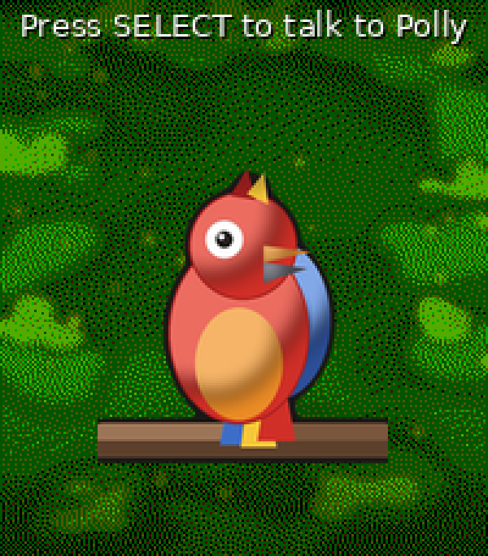
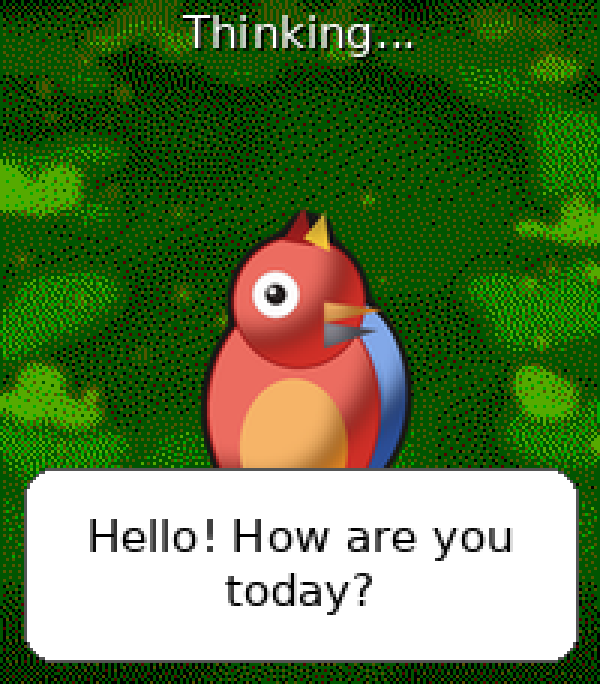

# Polly

A parrot on your Pebble Time 2 that talks. Real audio through the Speaker,
generated by Google Cloud Text-to-Speech on your phone.

**Buttons (while idle):**

| Button | Does |
|---|---|
| **SELECT** | Dictate a sentence — Polly speaks it back verbatim. |
| **UP** | Dictate a question — Polly asks Claude (AI) and speaks a short answer. |
| **DOWN** | Open a menu of your preset "quick phrases" and pick one to speak. |

Between interactions the parrot idles with small animations: blinking, head
tilts, sideways steps, hops, head-bobs, and the occasional wing-flap.

## Screenshots

| Idle | Thinking | Speaking |
|:---:|:---:|:---:|
|  |  |  |

## Setup (one-time)

Polly needs your own Google Cloud TTS API key. Open the settings via the
Pebble app on your phone (gear icon next to Polly) and fill in:

### 1. Get an API key

1. Go to the [Google Cloud Console](https://console.cloud.google.com)
2. Create a project (or pick an existing one)
3. **APIs & Services → Library** → search for **Cloud Text-to-Speech API** →
   "Enable"
4. Enable **billing** for the project (required, even though you'll likely
   stay within the free tier — see below; no charges as long as you do)
5. **APIs & Services → Credentials → Create Credentials → API key**
6. Recommended: restrict the key to just the Text-to-Speech API
   ("Restrict key → API restrictions") — that way a leaked key is useless for
   any other Google service

Paste the key into the **"API key"** field. It's stored only locally on your
phone (`localStorage`) and is never sent to the watch or anywhere else.

**Free tier (per month, resets monthly):**
| Voice type | Free characters/month |
|---|---|
| Standard | 4,000,000 |
| WaveNet | 1,000,000 |
| Neural2 / Studio / Chirp 3 HD | 1,000,000 |

Source: [cloud.google.com/text-to-speech/pricing](https://cloud.google.com/text-to-speech/pricing)

### 2. Pick a specific voice (optional)

By default Polly just uses the default voice for the chosen language. To use
a specific voice (e.g. a more natural-sounding WaveNet or Chirp voice), look
up the exact name in Google's overview:

📋 [Supported voices and languages](https://docs.cloud.google.com/text-to-speech/docs/list-voices-and-types)
— filter by language (e.g. `nl-NL`), listen to samples, and copy the exact
name (e.g. `nl-NL-Wavenet-B`, `nl-NL-Chirp3-HD-Achernar`) into the
**"Specific voice"** field.

> Note: as soon as you fill in a voice name, Polly derives the language from
> that name's prefix (e.g. `nl-BE-Wavenet-C` → `nl-BE`) and ignores the
> language dropdown. This avoids "voice/language mismatch" errors from Google
> for locales the dropdown doesn't list (such as Belgian Dutch). Leave the
> field empty to just use the dropdown's language with its default voice.

### 3. Ask-AI (optional, for the UP button)

To use the UP button, add a **free Google Gemini API key** in the **"Ask AI"**
settings section. Create one for free in
[Google AI Studio](https://aistudio.google.com/apikey) (keys start with `AIza`).
Questions are answered by `gemini-2.5-flash-lite` in 1–2 short sentences, then
spoken via the same Google TTS voice. Like the other keys, the Gemini key is stored only
on your phone (`localStorage`) and is never sent to the watch.

### 4. Quick phrases (optional, for the DOWN button)

Fill in up to four fixed phrases under **"Snelle zinnen"**. Pressing DOWN on the
watch opens a menu of the non-empty ones; pick one and Polly speaks it instantly
(no dictation needed). These are stored on the watch.

## Building & running

```sh
pebble build
pebble install --emulator emery       # emulator (note: no mic/speaker pairing)
pebble install --cloudpebble          # real PT2 device via Dev Connect
```

> Dictation and the Speaker round-trip require a real device + phone — the
> emulator has no microphone and can't play back the TTS audio.

## Project layout

```
src/c/
  polly.c             init/orchestration, AppMessage dispatch
  parrot_window.c     parrot illustration + speech bubble + status label
  parrot_anim.c       idle/speaking animations (frame-cycling via AppTimer)
  dictation_flow.c    Dictation session lifecycle
  audio_playback.c    chunk buffering + speaker_stream_* playback
  config.c            settings: persistence + Clay inbox
src/pkjs/
  index.js            Clay bridge, Google TTS call, audio streaming to watch
  config.json         settings screen fields (Clay)
```
